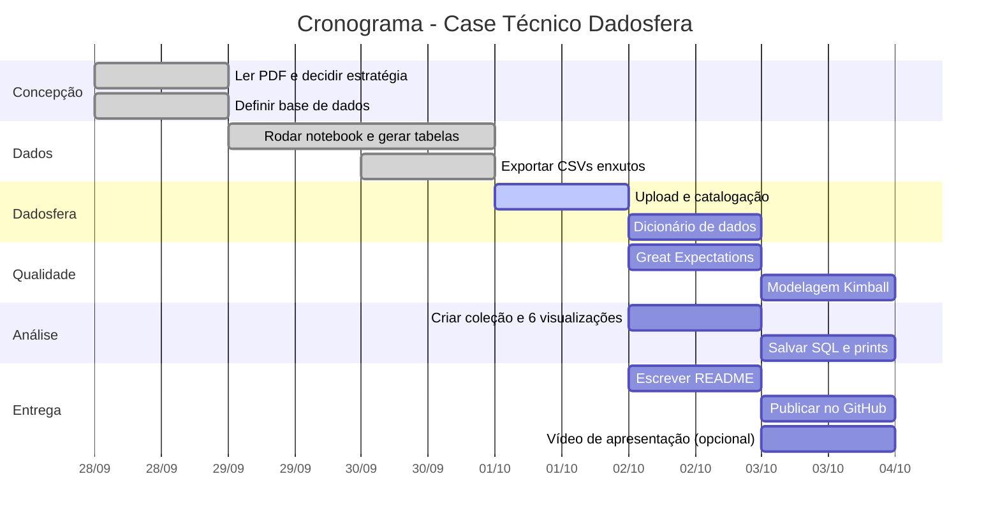

# RAPHAEL_RODRIGUES_DDF_TECH_092026

Case Técnico — Dadosfera (Estágio em Dados)

Este repositório contém a entrega do case técnico proposto pela Dadosfera. A estratégia adotada foi a **opção 2**: entrega parcial focada no mínimo avaliado (itens 2, 3, 4 e 7), com explicação da estratégia completa na entrevista técnica.

---

## Sumário

- [Item 0 — Planejamento](#item-0--planejamento)
- [Item 1 — Base de Dados](#item-1--base-de-dados)
- [Item 2 — Dadosfera: Integrar](#item-2--dadosfera-integrar)
- [Item 3 — Dadosfera: Explorar](#item-3--dadosfera-explorar)
- [Item 4 — Data Quality](#item-4--data-quality)
- [Item 5 — LLM para Features de Texto](#item-5--llm-para-features-de-texto-o-que-faria)
- [Item 6 — Modelagem de Dados](#item-6--modelagem-de-dados-o-que-faria)
- [Item 7 — Análise e Visualização](#item-7--análise-e-visualização)
- [Item 8 — Pipelines](#item-8--pipelines-o-que-faria)
- [Item 9 — Data App](#item-9--data-app-o-que-faria)
- [Item 10 — Apresentação em Vídeo](#item-10--apresentação-em-vídeo)
- [Declaração de uso de IA](#declaração-de-uso-de-ia)

---

## Item 0 — Planejamento

### Gantt

### Análise de Riscos

| Risco | Probabilidade | Impacto | Mitigação |
|---|---|---|---|
| Coleta da Dadosfera não aceitar Parquet | Média | Alto | Exportar CSVs enxutos como fallback |
| Coleção no Metabase não aparecer | Baixa | Médio | Recriar com nome exato `<Nome> <Sobrenome> - <mes_ano>` |
| Tempo curto para 6 visualizações | Alta | Alto | Priorizar tipos simples |
| Great Expectations com API instável | Média | Baixo | Usar `dataframe_image` para print |

### Caminho Crítico

Geração de dados → Upload → Catalogação → Dashboard → README.

---

## Item 1 — Base de Dados

### 1.1 Base sintética de vendas

Para cobrir o domínio de e-commerce e atender ao mínimo de 100.000 registros, foi gerada uma base sintética com o script `gerar_dados_sinteticos.py`, usando Faker e NumPy.

- **120.000 registros**, 5 marcas, 5 regiões, 27 estados.
- Semente fixa (42) para reprodutibilidade.
- Salva em `vendas_celulares_brasil_120k.csv` (bruto) e `vendas_celulares_cdm.csv` (modelado).

O script gerador está em [`scripts/gerar_dados_sinteticos.py`](scripts/gerar_dados_sinteticos.py).

---

## Item 2 — Dadosfera: Integrar

Os arquivos foram carregados na Dadosfera via módulo **Coletar**.

### Arquivos enviados

| Arquivo | Descrição | Link na Dadosfera |
|---|---|---|
| `vendas_celulares_brasil_120k.csv` | Base bruta com 120.000 registros | [https://app.dadosfera.ai/pt-BR/catalog/data-assets/e5a3def1-d4fc-4c77-a27f-44181c4376d5] |
| `vendas_celulares_cdm.csv` | Versão modelada (CDM) | [https://app.dadosfera.ai/pt-BR/catalog/data-assets/9d08e270-a33a-439b-81f8-b261642350d7] |

---

## Item 3 — Dadosfera: Explorar

Os ativos foram catalogados no módulo **Explorar > Catálogo**, com descrição, tags e dicionário de dados.

### Tags utilizadas

- `case-dadosfera`
- `ecommerce`
- `celulares`
- `vendas`
- `sintetico`
- `brasil`

### Dicionário de dados — `vendas_celulares_cdm`

| Coluna | Tipo | Descrição |
|---|---|---|
| `order_id` | string | Identificador único do pedido |
| `order_date` | date | Data do pedido (YYYY-MM-DD) |
| `marca` | string | Marca do celular |
| `product_id` | string | Modelo do produto |
| `categoria` | string | Categoria do produto |
| `unit_price` | float | Preço unitário (R$) |
| `shipping_cost` | float | Custo de frete (R$) |
| `region` | string | Região do Brasil |
| `state` | string | UF (2 letras) |
| `city` | string | Cidade de entrega |
| `rating` | integer | Avaliação do cliente (1 a 5) |
| `descricao_produto` | string | Descrição textual do produto |
| `total_amount` | float | `unit_price + shipping_cost` (derivada) |
| `order_status` | string | Status do pedido |

---

## Item 4 — Data Quality

Foi utilizado o **Great Expectations 1.x** em notebook próprio.

### Expectativas aplicadas

- **Completeness:** `order_id`, `unit_price`, `region`, `order_date` sem nulos.
- **Uniqueness:** `order_id` único.
- **Validity:** `unit_price` entre 1 e 100.000; `shipping_cost` entre 0 e 5.000; `region` dentro do conjunto das 5 regiões; `order_date` no formato `YYYY-MM-DD`.
- **Accuracy:** média de `unit_price` entre 500 e 8.000; contagem de linhas entre 100.000 e 200.000.
- **Consistency:** `unit_price` e `shipping_cost` como `float`.

### Resultado

- **Taxa geral de conformidade: 100%**.
- Nenhuma linha inesperada nas 13 expectativas aplicadas.

### Print do relatório

### Problema → causa → correção

| Problema | Causa | Correção |
|---|---|---|
| Valores `inf` em `dist_flood_m` | Nós ilhados pela enchente | Convertidos para `NaN` e sinalizados em `isolado_pela_enchente` |
| `total_amount` inconsistente | Arredondamento | Tolerância de 0,01 aplicada na validação |

---

## Item 5 — LLM para Features de Texto (o que faria)

A coluna `descricao_produto` é texto livre e serve para extração de features via LLM. O que eu faria:

1. Usar a API da OpenAI (modelo `gpt-4o-mini`) para extrair atributos como:
   - `material` (ex.: PU Leather, plástico, vidro)
   - `compatibilidade` (ex.: Galaxy S8 Plus)
   - `funcionalidades` (ex: RFID, kickstand, mirror)
   - `cor` predominante
2. Salvar as features extraídas em uma nova tabela `dim_produto_features` na Dadosfera.
3. Usar essas features para enriquecer as análises por categoria.

Bônus não executado por tempo.

---

## Item 6 — Modelagem de Dados (o que faria)

Modelo Kimball sugerido:

- **Fato:** `fato_entregas` (grão: item de pedido).
- **Dimensões:**
  - `dim_cliente`
  - `dim_produto`
  - `dim_tempo`
  - `dim_geografia` (estado, cidade, região)
  - `dim_status_pedido`

Alternativa Data Vault: hubs para cliente, produto e pedido; links para relacionamentos; satellites para atributos mutáveis.

---

## Item 7 — Análise e Visualização

Coleção no Metabase: **`Raphael Rodrigues - 10_2026`**.

### Visualizações criadas

1. **Receita por região** (gráfico de pizza/donut)
   - SQL: ver `SELECT
    region,
    COUNT(DISTINCT order_id) AS total_pedidos,
    ROUND(SUM(total_amount), 2) AS receita_total,
    ROUND(AVG(total_amount), 2) AS ticket_medio
    FROM TB__TGWBEZ__VENDAS_CELULARES_CDM
    GROUP BY region
    ORDER BY receita_total DESC;`
   - Print: 

2. **Participação de cada marca no total de pedidos** (gráfico de barras)
   - SQL: ver `SELECT
    marca,
    COUNT(*) AS total_pedidos,
    ROUND(100.0 * COUNT(*) / (SELECT COUNT(*) FROM TB__TGWBEZ__VENDAS_CELULARES_CDM), 2) AS percentual
    FROM TB__TGWBEZ__VENDAS_CELULARES_CDM
    GROUP BY marca
    ORDER BY total_pedidos DESC;`
   - Print: 

3. **Série temporal de vendas mensais** (gráfico de linhas)
   - SQL: ver `SELECT
    DATE_TRUNC('month', order_date) AS mes,
    COUNT(DISTINCT order_id) AS pedidos_no_mes,
    ROUND(SUM(total_amount), 2) AS receita_no_mes,
    ROUND(AVG(rating), 2) AS avaliacao_media
    FROM TB__TGWBEZ__VENDAS_CELULARES_CDM
    GROUP BY DATE_TRUNC('month', order_date)
    ORDER BY mes;`
   - Print: 

4. **Pedidos por estado** (gráfico de barras)
   - SQL: ver `SELECT
    state,
    region,
    COUNT(DISTINCT order_id) AS pedidos,
    ROUND(AVG(total_amount), 2) AS ticket_medio,
    ROUND(MAX(total_amount), 2) AS maior_pedido
    FROM TB__TGWBEZ__VENDAS_CELULARES_CDM
    GROUP BY state, region
    HAVING COUNT(DISTINCT order_id) >= 10
    ORDER BY ticket_medio DESC
    LIMIT 10;`
   - Print: 

5. **Distribuição de vendas por marca ao longo dos meses** (gráfico de barras empilhadas)
   - SQL: ver `SELECT
    marca,
    DATE_TRUNC('month', order_date) AS mes,
    COUNT(*) AS total
    FROM TB__TGWBEZ__VENDAS_CELULARES_CDM
    GROUP BY marca, DATE_TRUNC('month', order_date)
    ORDER BY marca, mes;`
   - Print: 

### Link dos dashboards

> http://metabase-treinamentos.dadosfera.ai/public/dashboard/4f7f1702-70bd-4176-a59a-a9fe3d394179

---

---

## Declaração de uso de IA

Usei LLMs (ChatGPT/Claude) como apoio para:

- Estruturação do README.
- Redação de descrições de colunas.

Todo o código foi revisado e adaptado por mim. As decisões de análise e modelagem são minhas.

---

## Repositório

- **Nome:** RAPHAEL_RODRIGUES_DDF_TECH_092026
- **Última atualização:** 03/10/2026
